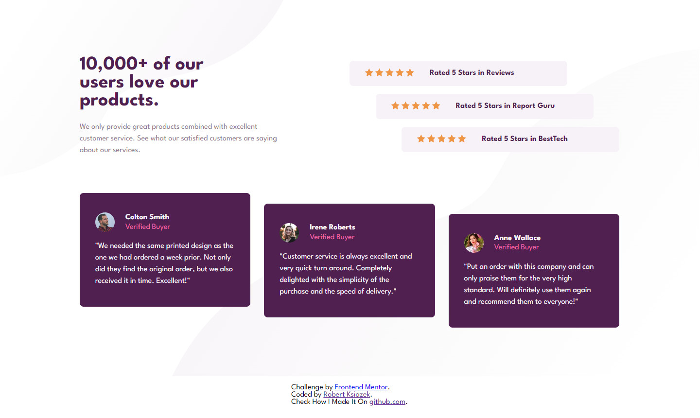

# Frontend Mentor - Social proof section solution

This is a solution to the [Social proof section challenge on Frontend Mentor](https://www.frontendmentor.io/challenges/social-proof-section-6e0qTv_bA). Frontend Mentor challenges help you improve your coding skills by building realistic projects.

## Table of contents

- [Overview](#overview)
  - [The challenge](#the-challenge)
  - [Screenshot](#screenshot)
  - [Links](#links)
- [My process](#my-process)
  - [Built with](#built-with)
  - [What I learned](#what-i-learned)
  - [Continued development](#continued-development)
  - [Useful resources](#useful-resources)
- [Author](#author)
- [Acknowledgments](#acknowledgments)

## Overview

### The challenge

Users should be able to:

- View the optimal layout for the section depending on their device's screen size

### Screenshot

### Links

- Solution URL: https://github.com/Robert-Lukasz-Ksiazek/social-proof-section-master
- Live Site URL: https://robert-lukasz-ksiazek.github.io/social-proof-section

## My process

### Built with

- Semantic HTML5 markup
- CSS custom properties
- Flexbox
- CSS Grid

### What I learned

I learned how to use media query and become confident using Grid and Flexbox.

### Continued development

Now I would like to continue learning about designig layouts, typography and color theory.

### Useful resources

https://developer.mozilla.org/en-US/

## Author

- Website - Robert Ksiazek https://www.your-site.com
- Frontend Mentor - @Robert-Lukasz-Ksiazek https://www.frontendmentor.io/profile/Robert-Lukasz-Ksiazek
- Twitter - @_robertksiazek_ https://www.twitter.com/_robertksiazek_/

## Acknowledgments

To my family
